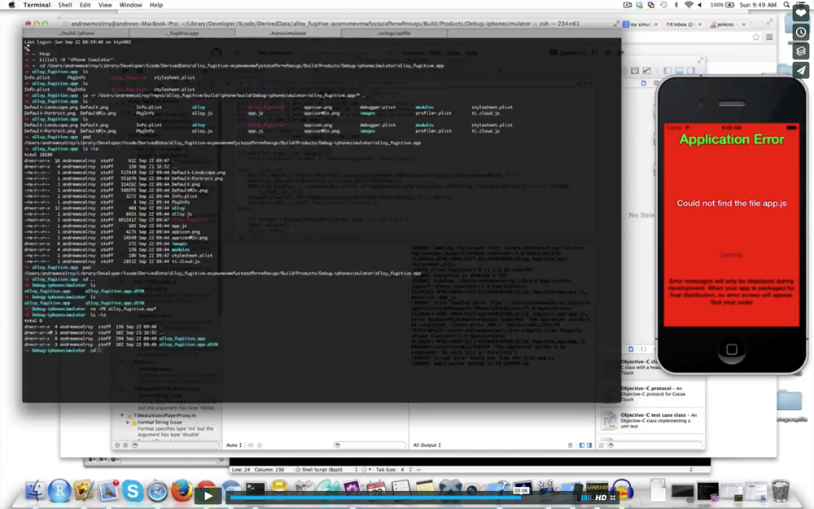
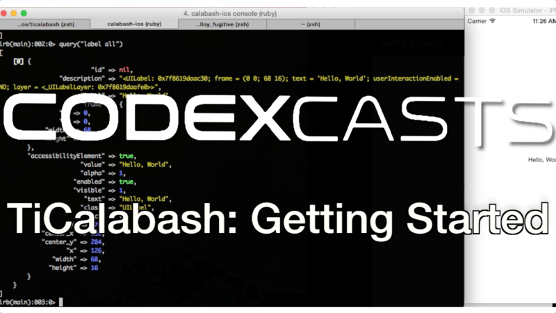

# FixAppJS

FixAppJS on Titanium iOS projects corrects the "Could not find the file app.js" issue.

## Why is this needed?
Appcelerator has a history of regressing to "Could not find the file app.js" when you try to open Xcode and use their generated Xcode project and I have a history of fixing and/or reporting it.

In 2013 I had this to say:

[](https://vimeo.com/75159222
)

Fast forward to 2016 and Appcelerator has [this problem](https://jira.appcelerator.org/browse/AC-623) [yet again](https://jira.appcelerator.org/browse/TIMOB-20253). Their stance is [We do not support opening the generated Xcode project since Titanium 4.0.0](https://jira.appcelerator.org/browse/AC-4549). It's time for a Titanium CLI hook that just fixes the problem for good already. **Enter FixAppJS.**


This Titanium CLI Hook works for both Titanium Classic and Alloy. At this time I am ignoring hyperloop compatibility, although that would not be difficult to add.


## Install

As global Titanium CLI hook:

    $ npm install -g fixappjs

## Usage

This only works for iOS builds. Simply append --fixappjs to the end of your appc or ti build command:
```
$ ti build --platform=iphone --fixappjs
```

If you attempt to use --fixappjs on android, this plugin will stop the build and issue the following error:

 ```
[DEBUG] No project level plugins to load
[ERROR] You can't run --fixappjs for android Projects!
  It's for iOS projects only!!!
 ```

 Let's make this the last time we have to handle this issue. Once you have Xcode back, all kinds of possibilities open up.

## What's Possible Now?

So now that we have back our generated Xcode project, so what. What can I do now that I couldn't do before?

Here's three ideas, with many more in the works.

 [](https://codexcasts.com/episodes/titanium-and-xcode-instruments-6-3
 )

 [](https://codexcasts.com/episodes/ticalabash-getting-started
 )

 [](https://codexcasts.com/episodes/getting-started-with-react-titanium
 )

To be fair, you don't strictly need this plugin to make this last one work.

 Keep an eye on both https://CodexCasts.com and http://shockoe.com/blog/ for more content.


## TODO/ ways you can help

If you find a bug please report it.
Pull Requests are welcome.

## Final Notes

This project is not affiliated with Appcelerator in any way. As stated earlier, they no longer support using their generated Xcode project. If you run into issues, please file a bug with this project.

## Misc Troubleshooting Notes

Please note that you should not ever install a npm package using sudo.
If you are here is how you can resolve that issue.
First, get your npm prefix path.

    $ npm config get prefix
You will likely see:
 ```
 /usr/local
 ```
If you don't see anything, then consider reinstalling npm.

Next you will want to run:
```
    $ sudo chown -R $(whoami) $(npm config get prefix)/{lib/node_modules,bin,share}
```

If you ran
```
$ npm install -g fixappjs
```
and saw an error that looked like this:

```
Unable to write config file /User/your_username/.titanium/config.json
Please ensure the Titanium CLI has access to modify this file
```
Then you need to also run:
```
$ sudo chown -R $(whoami) .titanium
```

##### DerivedData

DerivedData deserves is own special place in ~~hell~~ this README. It will likely be the biggest (technical) reason over time that this cli hook could fail. At this time there are no issues being caused by DerivedData that I am aware of. 


## License

Copyright 2016 Andrew McElroy

Licensed under the Apache License, Version 2.0 (the "License");
you may not use this file except in compliance with the License.
You may obtain a copy of the License at

   http://www.apache.org/licenses/LICENSE-2.0

Unless required by applicable law or agreed to in writing, software
distributed under the License is distributed on an "AS IS" BASIS,
WITHOUT WARRANTIES OR CONDITIONS OF ANY KIND, either express or implied.
See the License for the specific language governing permissions and
limitations under the License.
</pre>
